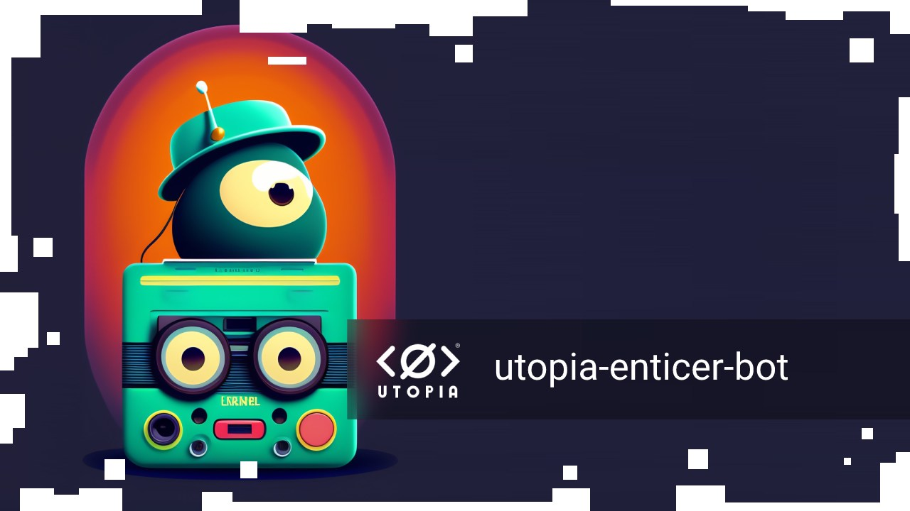

A bot that entices users into certain channels

Features:
1. Support for promoting multiple channels in multiple channels.
2. Automatic download of channel data.
3. Quick and easy run from the docker.
4. Possibility to set a specific account file.

TODO:

* auto-change account nickname;

---

## SETUP

It is sufficient to change the parameters in file `docker-compose.yml`

* `UTOPIA_` - parameters to connect to the client. When working with the docker, these parameters do not need to be changed.

* `ACTION_TIMEOUT_HOURS` - once every how many hours to publish a message about joining the channel.

* `CHAT_IDS` - matching the IDs of your promoted channels and the channels in which to publish messages.

Example: `E36921F241EA9A3ABE03308BF41E0C37:7059882759A545496050909C910D8AA0,EB3D3060924FE529271B2511DF51071F`

This means that the bot must promote the channel `E36921F241EA9A3ABE03308BF41E0C37` in channels:
1. `7059882759A545496050909C910D8AA0`
2. `EB3D3060924FE529271B2511DF51071F`

An example, if you need to promote several channels:

`E36921F241EA9A3ABE03308BF41E0C37:7059882759A545496050909C910D8AA0,EB3D3060924FE529271B2511DF51071F;EF978A706EEE71AB24A29D069CCCAA7D:7059882759A545496050909C910D8AA0`

An `;` has been added here to separate the setting groups.

---

## How to disable bot in my channel?

Just add new hashtag to your channel: `no-bots`
